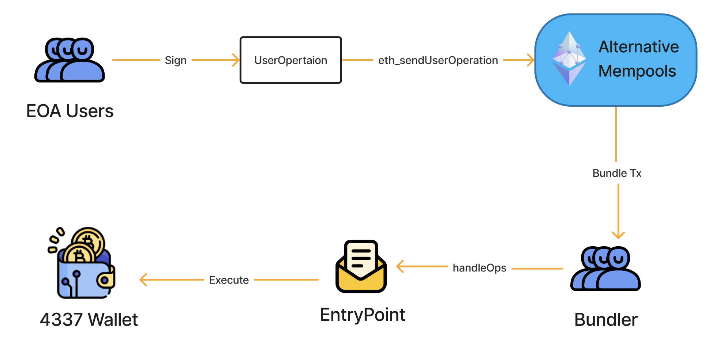
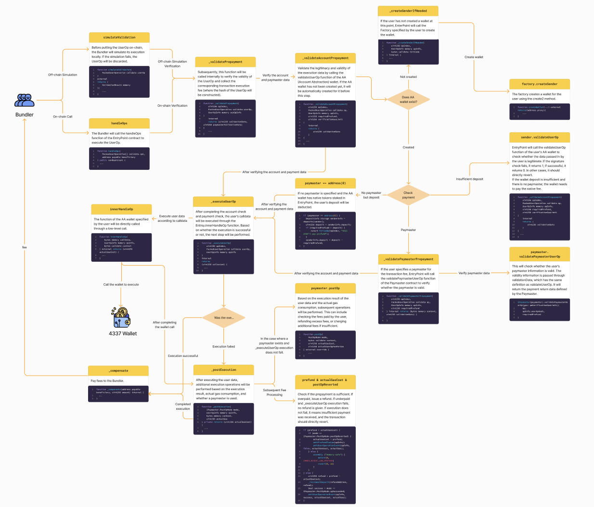

By: [Kong'](https://twitter.com/TycheKong)@SlowMist Security Team

## Introduction

This article aims to provide auditors with a baseline checklist for auditing account abstraction wallets implemented based on the EIP4337 standard, along with some targeted auditing guidelines. It assumes that auditors are already familiar with the [EIP4337 Account Abstraction Standard](https://eips.ethereum.org/EIPS/eip-4337) and the [EIP7562 Account Abstraction Validation Scope Rules Standard](https://eips.ethereum.org/EIPS/eip-7562), so it will not go into further detail about these two standards. Next, we will briefly introduce the EIP4337 architecture and wallet transaction execution flow.

## Architecture

#### Transaction Execution

In the EIP4337 design standard, an EOA first signs data of the [UserOperation](https://eips.ethereum.org/EIPS/eip-4337#useroperation) type and submits it to a separate [Alt Mempools](https://eips.ethereum.org/EIPS/eip-4337#alternative-mempools) via RPC. This mempool is independent of the Ethereum mempool and aggregates the UserOp data submitted by users. The Bundler extracts UserOps from this mempool to help users execute them, performing [local simulation](https://eips.ethereum.org/EIPS/eip-4337#simulation) before execution. UserOps that fail the simulation are discarded. All UserOp executions are carried out by the Bundler calling the [EntryPoint](https://eips.ethereum.org/EIPS/eip-4337#entrypoint-definition) contract. After a series of verifications, EntryPoint calls the user's AA wallet to execute the user's calldata. In this process, the user needs to pay the Bundler for the on-chain execution fees or specify a [Paymaster](https://eips.ethereum.org/EIPS/eip-4337#extension-paymasters) to pay on their behalf.



#### Execution Details

The following outlines the detailed process of the Bundler calling the user's wallet through EntryPoint. Auditors should be familiar with this process.

Detailed flow chart: [4337 Execution Details](https://www.figma.com/board/BdfLFkbZkh8vQlsANfojbL/4337-Execution-Details_EN?node-id=0-1&t=KB21kmnkI4r4X0vY-1)



## Checklist

Based on the above architecture, the SlowMist security team has listed the following checklist items. Auditors should ensure that each 4337 wallet passes the following checks:

#### 1. Check Compatibility with All EVM-Compatible Chains

Most AA wallets may not only be deployed on the Ethereum mainnet. Since the mainnet added the `PUSH0` bytecode after the Shanghai upgrade, Solidity versions [0.8.20](https://soliditylang.org/blog/2023/05/10/solidity-0.8.20-release-announcement/) and later use the post-Shanghai upgrade version by default. Therefore, the compiled bytecode may not be applicable to all EVM-compatible chains.

Auditors should check the Solidity version used for contract compilation or check the compiled files for the presence of the `PUSH0` bytecode. For multi-chain deployment, it is recommended to use a compiler version lower than 0.8.20, or specify the compilation version as `paris`.

```toml
solc = "0.8.19"
evm_version = "paris"
```

#### 2. Check if interface implementation and return values comply with the EIP4337 standard

The [EIP4337 standard](https://eips.ethereum.org/EIPS/eip-4337#account-contract-interface) specifies that wallets must implement the following core interfaces, and their return value `validationData` must include three values: authorizer, validUntil, and validAfter.

```solidity
function validateUserOp
    (PackedUserOperation calldata userOp, bytes32 userOpHash, uint256 missingAccountFunds)
    external returns (uint256 validationData);
```

Similarly, the Paymaster contract must also implement the following core interfaces, where the return value `validationData` of `validatePaymasterUserOp` must also include three values: authorizer, validUntil, and validAfter.

```solidity
function validatePaymasterUserOp
    (PackedUserOperation calldata userOp, bytes32 userOpHash, uint256 maxCost)
    external returns (bytes memory context, uint256 validationData);

function postOp
    (PostOpMode mode, bytes calldata context, uint256 actualGasCost, uint256 actualUserOpFeePerGas)
    external;
```

When signature validation fails, the authorizer should return `SIG_VALIDATION_FAILED` (value 1). On successful validation, the authorizer should return `SIG_VALIDATION_SUCCESS` (value 0), rather than revert. Any other failure scenarios should result in a revert.

#### 3. Check if wallet callers are trusted

In the EIP4337 standard, the validateUserOp, executeUserOp, validatePaymasterUserOp, postOp, and data execution interfaces implemented by the wallet or Paymaster should only allow trusted EntryPoint to call them. This is to prevent risks such as asset loss caused by unauthorized use of the wallet.

[Example Code:](https://github.com/eth-infinitism/account-abstraction/blob/f1c5c11b273b7ddae26bb20809419b33ccb8f043/contracts/samples/SimpleAccount.sol#L58-L82)

```solidity
function entryPoint() public view virtual override returns (IEntryPoint) {
   return _entryPoint;
}

function execute(address dest, uint256 value, bytes calldata func) external {
    _requireFromEntryPointOrOwner();
    _call(dest, value, func);
}

function executeBatch(address[] calldata dest, uint256[] calldata value, bytes[] calldata func) external {
    _requireFromEntryPointOrOwner();
    ...
}
```

#### 4. Check if fee payment functionality is implemented

If the user's wallet has sufficient native tokens, they can pay using the tokens in their wallet without needing to stake in the EntryPoint or specify a paymaster. The payment fee is passed by the EntryPoint through the `missingAccountFunds` parameter when calling the validateUserOp function. Therefore, auditors need to check whether the wallet's validateUserOp function includes the logic to transfer the `missingAccountFunds` amount of native tokens to the EntryPoint contract.

[Example Code:](https://github.com/eth-infinitism/account-abstraction/blob/f1c5c11b273b7ddae26bb20809419b33ccb8f043/contracts/core/BaseAccount.sol#L43)

```solidity
function validateUserOp(
    PackedUserOperation calldata userOp,
    bytes32 userOpHash,
    uint256 missingAccountFunds
) external virtual override returns (uint256 validationData) {
    ...
    _payPrefund(missingAccountFunds);
}
```

#### 5. Check wallet creation method

When the user's wallet has not yet been created, they can specify a factory for wallet creation in the UserOp. The factory must use `CREATE2` to create the wallet to avoid the creation address being influenced by the order of creation. Some users need to know the wallet address before it is fully created to transfer funds and cover creation fees. Therefore, when auditing the factory contract, auditors need to ensure that the wallet creation method uses CREATE2.

[Example Code:](https://github.com/eth-infinitism/account-abstraction/blob/f1c5c11b273b7ddae26bb20809419b33ccb8f043/contracts/samples/SimpleAccountFactory.sol#L34)

```solidity
function createAccount(address owner,uint256 salt) public returns (SimpleAccount ret) {
    address addr = getAddress(owner, salt);
    uint256 codeSize = addr.code.length;
    if (codeSize > 0) {
        return SimpleAccount(payable(addr));
    }
    ret = SimpleAccount(payable(new ERC1967Proxy{salt : bytes32(salt)}(
            address(accountImplementation),
            abi.encodeCall(SimpleAccount.initialize, (owner))
        )));
}
```

#### 6. Check the return value for repeated creation of the same wallet

The [EIP 4337 standard](https://eips.ethereum.org/EIPS/eip-4337#first-time-account-creation) requires that for wallets that have already been created, if the same data is passed in, the same address should be returned. This is to make it easier for clients to query the address without needing to know whether the wallet has been deployed, and to avoid unexpected creation failures or the creation of wallets at unintended addresses.

[Example Code:](https://github.com/eth-infinitism/account-abstraction/blob/f1c5c11b273b7ddae26bb20809419b33ccb8f043/contracts/samples/SimpleAccountFactory.sol#L32)

```solidity
function createAccount(address owner,uint256 salt) public returns (SimpleAccount ret) {
    address addr = getAddress(owner, salt);
    uint256 codeSize = addr.code.length;
    if (codeSize > 0) {
        return SimpleAccount(payable(addr));
    }
    ...
}
```

#### 7. Check if wallet can be takeover during creation

Before wallet creation, users might transfer fees to the pre-created address to pay for creation costs, ensuring that the transaction will not fail when creating the same address. Therefore, auditors need to check if the wallet can be front-run and created by someone else. If it can be, they should check whether the ownership of the wallet created in advance is correct and pay special attention to whether there are initialization parameters that are not involved in the address calculation and whether these parameters can be modified.

[Example of Incorrect Code:](https://code4rena.com/reports/2023-01-biconomy#h-03-attacker-can-gain-control-of-counterfactual-wallet) (entryPoint not involved in address calculation, can be takeover and modified to a malicious entryPoint)

```solidity
function deployCounterFactualWallet(address _owner, address _entryPoint, address _handler, uint _index) public returns(address proxy){
    bytes32 salt = keccak256(abi.encodePacked(_owner, address(uint160(_index))));
    bytes memory deploymentData = abi.encodePacked(type(Proxy).creationCode, uint(uint160(_defaultImpl)));
    // solhint-disable-next-line no-inline-assembly
    assembly {
        proxy := create2(0x0, add(0x20, deploymentData), mload(deploymentData), salt)
    }
    require(address(proxy) != address(0), "Create2 call failed");
    // EOA + Version tracking
    emit SmartAccountCreated(proxy,_defaultImpl,_owner, VERSION, _index);
    BaseSmartAccount(proxy).init(_owner, _entryPoint, _handler);
    isAccountExist[proxy] = true;
}
```

#### 8. Check signature validity verification

The wallet must support the `validateUserOp` interface to verify the validity of the UserOp passed in by the EntryPoint. Similarly, the Paymaster must support the `validatePaymasterUserOp` interface to verify the validity of the paymaster information. Therefore, auditors must rigorously check the validity of the signatures in the UserOp within validateUserOp/validatePaymasterUserOp to prevent the wallet from being maliciously executed or the signatures from being replayed.

[Example Code:](https://github.com/eth-infinitism/account-abstraction/blob/f1c5c11b273b7ddae26bb20809419b33ccb8f043/contracts/core/BaseAccount.sol#L41)

```solidity
function validateUserOp(
    PackedUserOperation calldata userOp,
    bytes32 userOpHash,
    uint256 missingAccountFunds
) external virtual override returns (uint256 validationData) {
    _requireFromEntryPoint();
    validationData = _validateSignature(userOp, userOpHash);
    _validateNonce(userOp.nonce);
    _payPrefund(missingAccountFunds);
}
```

#### 9. Check if ERC1271 is correctly implemented

Account abstraction wallets may implement the [EIP1271 standard](https://eips.ethereum.org/EIPS/eip-1271) to support verifying 1271 signatures from contracts. The standard specifies implementing the specific verification logic through the `isValidSignature` interface. Auditors need to strictly check whether the ERC1271 standard implementation complies with the specification and ensure the signature verification logic is secure and reliable.

[Example Code:](https://github.com/safe-global/safe-smart-account/blob/499b17ad0191b575fcadc5cb5b8e3faeae5391ae/contracts/handler/CompatibilityFallbackHandler.sol#L57-L68)

```solidity
function isValidSignature(bytes32 _dataHash, bytes calldata _signature) public view override returns (bytes4) {
    // Caller should be a Safe
    ISafe safe = ISafe(payable(msg.sender));
    bytes memory messageData = encodeMessageDataForSafe(safe, abi.encode(_dataHash));
    bytes32 messageHash = keccak256(messageData);
    if (_signature.length == 0) {
        require(safe.signedMessages(messageHash) != 0, "Hash not approved");
    } else {
        safe.checkSignatures(messageHash, _signature);
    }
    return EIP1271_MAGIC_VALUE;
}
```

#### 10. Check if staked tokens to EntryPoint can be permanently locked

To pay execution fees, account abstraction wallets may implement the logic of staking native tokens to the EntryPoint. Similarly, to enhance [reputation](https://eips.ethereum.org/EIPS/eip-7562), Paymaster contracts and wallet factory contracts may also implement the logic of staking native tokens to the EntryPoint. The [EIP7562 standard](https://eips.ethereum.org/EIPS/eip-7562#validation-rules) requires that the minimum unstake delay for staking entities must be `MIN_UNSTAKE_DELAY` (1 day). Thus, the staking time is usually determined by the caller or hardcoded in the contract. Auditors need to check whether anyone can pass any lock-in time `unstakeDelaySec` for staking, which may lead to the staked tokens being permanently locked.

[Example Code:](https://github.com/eth-infinitism/account-abstraction/blob/f1c5c11b273b7ddae26bb20809419b33ccb8f043/contracts/core/BasePaymaster.sol#L117)

```solidity
function addStake(uint32 unstakeDelaySec) external payable onlyOwner {
    entryPoint.addStake{value: msg.value}(unstakeDelaySec);
}
```

#### 11. Check if wallet can execute transactions without going through EntryPoint

The EIP4337 standard requires the EntryPoint to execute user calldata either by directly calling the wallet or by invoking the executeUserOp function, with the wallet verifying the caller and the signature. Therefore, auditors need to check whether the wallet allows executing caller data without going through the EntryPoint. If it does, auditors need to verify that the wallet has correctly implemented permission checks to prevent the execution of malicious data.

[Example Code:](https://github.com/eth-infinitism/account-abstraction/blob/f1c5c11b273b7ddae26bb20809419b33ccb8f043/contracts/samples/SimpleAccount.sol#L59)

```solidity
    function execute(address dest, uint256 value, bytes calldata func) external {
        _requireFromEntryPointOrOwner();
        _call(dest, value, func);
    }
```

#### 12. Check if the wallet only accesses storage fields associated with the sender

To prevent the Bundler from executing UserOp, suffering from DoS attacks, and thus being unable to recover gas fee costs, the [EIP7562 standard](https://eips.ethereum.org/EIPS/eip-7562#storage-rules) stipulates that the wallet is only allowed to access storage associated with it. Otherwise, the Bundler will not accept this UserOp. Auditors need to check if the storage access in the wallet complies with this regulation.

#### 13. Check if the Paymaster's handling logic meets expectations after execution failure 

When innerHandleOp is executed within EntryPoint, it follows up with the fee processing logic through the [_postExecution function](https://github.com/eth-infinitism/account-abstraction/blob/f1c5c11b273b7ddae26bb20809419b33ccb8f043/contracts/core/EntryPoint.sol#L358) and calls the [postOp function](https://github.com/eth-infinitism/account-abstraction/blob/f1c5c11b273b7ddae26bb20809419b33ccb8f043/contracts/core/EntryPoint.sol#L705) of the Paymaster to handle the fees (e.g., refunds or adjustments). When innerHandleOp [execution fails](https://github.com/eth-infinitism/account-abstraction/blob/f1c5c11b273b7ddae26bb20809419b33ccb8f043/contracts/core/EntryPoint.sol#L143), fee processing still occurs via postExecution, but the postOp function of the Paymaster will not be triggered (even if the user has specified fee payment). Therefore, when auditing the Paymaster, special attention must be paid to ensure that in cases where both innerHandleOp and postOp fail due to malicious user actions, the Paymaster can correctly handle the fees to prevent the depletion of its funds.

#### 14. Check if the implementation of modular wallets is secure

EIP4337 wallets may support user-customizable extended wallet functionalities such as social recovery, contract upgrades, insurance vaults, and other modules. Auditors need to verify whether the wallet can safely manage the "addition/removal/use" of these modules. If modules are executed using `DELEGATECALL`, auditors should ensure the security of data stored in wallet slots.

*`To be continued...`*

## Conclusion

The above baseline checklist is based on the current EIP4337 account abstraction standard, providing auditors with a foundation for auditing account abstraction wallets. Since different wallet implementations vary and the implementation of EIP4337 is still in its early stages, auditors still need to conduct thorough checks based on the actual implementation of the wallet. For projects under development, the SlowMist security team recommends that developers carefully consider the above checklist during the development process.