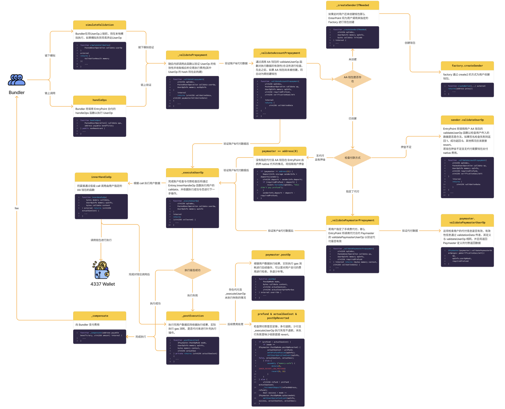

By: [Kong](https://twitter.com/TycheKong)@SlowMist Security Team

## 前言

本文旨在为审计人员提供以 EIP4337 标准实现的账户抽象钱包的审计基线检查项并提供部分针对性的审计指南。本文假设审计人员已经对 [EIP4337 账户抽象标准](https://eips.ethereum.org/EIPS/eip-4337)和 [EIP7562 账户抽象验证范围规则标准](https://eips.ethereum.org/EIPS/eip-7562)较为熟悉，因此不在深入赘述这两个标准。接下来，我们将简单介绍 EIP4337 架构与钱包交易执行流程。

## 架构

#### 交易执行

在 EIP4337 设计标准中，首先由 EOA 签署 [UserOperation](https://eips.ethereum.org/EIPS/eip-4337#useroperation) 类型的数据，并通过 RPC 提交到一个单独的 [Alt Mempools](https://eips.ethereum.org/EIPS/eip-4337#alternative-mempools)。此内存池独立于以太坊内存池，其汇总了用户提交的 UserOp 数据。Bundler 会从此内存池中提取 UserOp 以帮助用户执行，在执行之前将进行[本地模拟](https://eips.ethereum.org/EIPS/eip-4337#simulation)，模拟失败的 UserOp 将被丢弃。所有的 UserOp 执行都由 Bundler 调用 [EntryPoint](https://eips.ethereum.org/EIPS/eip-4337#entrypoint-definition) 合约进行执行。EntryPoint 经过一系列验证后将调用用户的 AA 钱包，执行用户的 calldata。在此过程中，用户需要向 Bundler 支付交易上链执行的手续费，或者指定一个 [Paymaster](https://eips.ethereum.org/EIPS/eip-4337#extension-paymasters) 进行代付。


#### 执行详情

以下是 Bundler 通过 EntryPoint 调用用户钱包的详细过程，审计人员应熟悉此流程。

详细流程图: [4337 Execution Details](https://www.figma.com/board/dWu1j2He9WaJin5pW6o3Hx/4337-Execution-Details_CN?node-id=0-1&t=Iy1930ilcXQY6m9v-1)



## 检查项

慢雾安全团队依据上述架构列出以下检查项，建议审计人员在对每个 4337 钱包进行审计时都确保其通过下述检查项：


#### 1. 检查是否兼容所有 EVM 兼容链

大部分 AA 钱包可能不止部署在 Ethereum 主网，因为主网在上海升级后新增了 `PUSH0` 字节码，而 Solidity 在 [0.8.20](https://soliditylang.org/blog/2023/05/10/solidity-0.8.20-release-announcement/) 版本及之后编译版本都默认为上海升级后的版本，因此其编译后的字节码可能不适用于所有的 EVM 兼容链。

审计人员在审计时应该检查合约编译使用的 Solidity 版本，或检查编译后的文件是否包含 `PUSH0` 字节码。在进行多链部署时，建议使用小于 0.8.20 版本的编译器，或者指定编译版本为 `paris`。

```toml
solc = "0.8.19"
evm_version = "paris"
```

#### 2. 检查接口实现与返回值是否符合 EIP4337 标准规范

[EIP4337 标准规定](https://eips.ethereum.org/EIPS/eip-4337#account-contract-interface)钱包必须实现以下核心接口，其返回值 `validationData` 必须包含三个值：authorizer、validUntil 和 validAfter。

```solidity
function validateUserOp
    (PackedUserOperation calldata userOp, bytes32 userOpHash, uint256 missingAccountFunds)
    external returns (uint256 validationData);
```

同样的代付合约 Paymaster 也必须实现以下核心接口，其中 `validatePaymasterUserOp` 的返回值 `validationData` 也同样必须包含三个值：authorizer、validUntil 和 validAfter。

```solidity
function validatePaymasterUserOp
    (PackedUserOperation calldata userOp, bytes32 userOpHash, uint256 maxCost)
    external returns (bytes memory context, uint256 validationData);

function postOp
    (PostOpMode mode, bytes calldata context, uint256 actualGasCost, uint256 actualUserOpFeePerGas)
    external;
```

当签名验证失败时，authorizer 需要返回 `SIG_VALIDATION_FAILED`(即 1 值)，验证成功时，authorizer 需要返回 `SIG_VALIDATION_SUCCESS`(即 0 值)，而不是 revet。如果是其他情况导致的失败交易都必须 revert。

#### 3. 检查钱包调用者是否可信

在 EIP4337 标准中，要求钱包或代付人实现的 validateUserOp、executeUserOp、validatePaymasterUserOp、postOp、数据执行接口等函数都应该只允许可信的 EntryPoint 进行调用，以避免钱包被未授权的使用导致资产丢失等风险。

[示例代码:](https://github.com/eth-infinitism/account-abstraction/blob/f1c5c11b273b7ddae26bb20809419b33ccb8f043/contracts/samples/SimpleAccount.sol#L58-L82)

```solidity
function entryPoint() public view virtual override returns (IEntryPoint) {
   return _entryPoint;
}

function execute(address dest, uint256 value, bytes calldata func) external {
    _requireFromEntryPointOrOwner();
    _call(dest, value, func);
}

function executeBatch(address[] calldata dest, uint256[] calldata value, bytes[] calldata func) external {
    _requireFromEntryPointOrOwner();
    ...
}
```

#### 4. 检查是否实现手续费支付功能

在用户钱包中有充足的原生代币情况下，其可以无需在 EntryPoint 中质押且无需指定代付人，即可使用钱包中的代币付款。付款费用由 EntryPoint 在调用 validateUserOp 函数时通过 `missingAccountFunds` 参数传入。因此审计人员需要检查钱包中的 validateUserOp 函数是否实现了向 EntryPoint 合约转账 `missingAccountFunds` 数额的原生代币的逻辑。

[示例代码:](https://github.com/eth-infinitism/account-abstraction/blob/f1c5c11b273b7ddae26bb20809419b33ccb8f043/contracts/core/BaseAccount.sol#L43)

```solidity
function validateUserOp(
    PackedUserOperation calldata userOp,
    bytes32 userOpHash,
    uint256 missingAccountFunds
) external virtual override returns (uint256 validationData) {
    ...
    _payPrefund(missingAccountFunds);
}
```

#### 5. 检查钱包创建方式

当用户钱包尚未创建时，其可以在 UserOp 中指定工厂进行钱包创建。工厂必须使用 `CREATE2` 创建钱包，以避免创建地址受到创建顺序的干扰。一些用户需要需要在还未完成创建之前就需要知道钱包地址，并向其转移资金以支付创建费用，因此审计人员在对工厂合约进行审计时需要确保钱包创建方式必须使用 CREATE2。

[示例代码:](https://github.com/eth-infinitism/account-abstraction/blob/f1c5c11b273b7ddae26bb20809419b33ccb8f043/contracts/samples/SimpleAccountFactory.sol#L34)

```solidity
function createAccount(address owner,uint256 salt) public returns (SimpleAccount ret) {
    address addr = getAddress(owner, salt);
    uint256 codeSize = addr.code.length;
    if (codeSize > 0) {
        return SimpleAccount(payable(addr));
    }
    ret = SimpleAccount(payable(new ERC1967Proxy{salt : bytes32(salt)}(
            address(accountImplementation),
            abi.encodeCall(SimpleAccount.initialize, (owner))
        )));
}
```

#### 6. 检查重复创建同一钱包的返回值

[EIP 4337 标准](https://eips.ethereum.org/EIPS/eip-4337#first-time-account-creation)，要求对于已经创建的钱包，如果传入相同的数据，应返回同一地址。这是为了让客户端更容易查询地址，而无需知道钱包是否已部署，也为了避免非预期的创建失败或者创建非预期地址的钱包。

[示例代码:](https://github.com/eth-infinitism/account-abstraction/blob/f1c5c11b273b7ddae26bb20809419b33ccb8f043/contracts/samples/SimpleAccountFactory.sol#L32)

```solidity
function createAccount(address owner,uint256 salt) public returns (SimpleAccount ret) {
    address addr = getAddress(owner, salt);
    uint256 codeSize = addr.code.length;
    if (codeSize > 0) {
        return SimpleAccount(payable(addr));
    }
    ...
}
```

#### 7. 检查钱包创建时是否可被接管

在钱包创建前，用户可能会先向预创建地址转入手续费以供创建时支付费用，并且使得在创建同一地址时也不会交易失败。因此，审计人员需要检查钱包是否可以被抢先创建，如果可以，应该检查被抢先创建后的钱包所有权是否正确，并着重检查是否存在未参与地址计算的初始化参数，如果钱包可以被抢先创建这些参数又能否被修改。

[错误示例代码:](https://code4rena.com/reports/2023-01-biconomy#h-03-attacker-can-gain-control-of-counterfactual-wallet) (entryPoint 不参与地址计算，可被抢先创建修改为恶意的 entryPoint)

```solidity
function deployCounterFactualWallet(address _owner, address _entryPoint, address _handler, uint _index) public returns(address proxy){
    bytes32 salt = keccak256(abi.encodePacked(_owner, address(uint160(_index))));
    bytes memory deploymentData = abi.encodePacked(type(Proxy).creationCode, uint(uint160(_defaultImpl)));
    // solhint-disable-next-line no-inline-assembly
    assembly {
        proxy := create2(0x0, add(0x20, deploymentData), mload(deploymentData), salt)
    }
    require(address(proxy) != address(0), "Create2 call failed");
    // EOA + Version tracking
    emit SmartAccountCreated(proxy,_defaultImpl,_owner, VERSION, _index);
    BaseSmartAccount(proxy).init(_owner, _entryPoint, _handler);
    isAccountExist[proxy] = true;
}
```

#### 8. 检查签名有效性验证

钱包必须支持 `validateUserOp` 接口以验证 EntryPoint 传入的 UserOp 的有效性，同样的，Paymaster 也必须支持 `validatePaymasterUserOp` 接口以验证代付信息的有效性。因此，审计人员必须在 validateUserOp/validatePaymasterUserOp 中严格检查 UserOp 中签名的有效性以避免钱包被恶意执行，或签名被重放。

[示例代码:](https://github.com/eth-infinitism/account-abstraction/blob/f1c5c11b273b7ddae26bb20809419b33ccb8f043/contracts/core/BaseAccount.sol#L41)

```solidity
function validateUserOp(
    PackedUserOperation calldata userOp,
    bytes32 userOpHash,
    uint256 missingAccountFunds
) external virtual override returns (uint256 validationData) {
    _requireFromEntryPoint();
    validationData = _validateSignature(userOp, userOpHash);
    _validateNonce(userOp.nonce);
    _payPrefund(missingAccountFunds);
}
```

#### 9. 检查是否正确实施了 ERC1271

账户抽象钱包可能实施 [EIP1271 标准](https://eips.ethereum.org/EIPS/eip-1271)以支持验证来自合约的 1271 签名，标准规定了通过 `isValidSignature` 接口以实现具体的验证逻辑。审计人员需要严格检查 ERC1271 标准的实施是否符合规范，且确保签名验证逻辑安全可靠。

[示例代码:](https://github.com/safe-global/safe-smart-account/blob/499b17ad0191b575fcadc5cb5b8e3faeae5391ae/contracts/handler/CompatibilityFallbackHandler.sol#L57-L68)

```solidity
function isValidSignature(bytes32 _dataHash, bytes calldata _signature) public view override returns (bytes4) {
    // Caller should be a Safe
    ISafe safe = ISafe(payable(msg.sender));
    bytes memory messageData = encodeMessageDataForSafe(safe, abi.encode(_dataHash));
    bytes32 messageHash = keccak256(messageData);
    if (_signature.length == 0) {
        require(safe.signedMessages(messageHash) != 0, "Hash not approved");
    } else {
        safe.checkSignatures(messageHash, _signature);
    }
    return EIP1271_MAGIC_VALUE;
}
```

#### 10. 检查向 EntryPoint 的质押代币是否可被永久锁定

账户抽象钱包为了支付执行费用，可能实现向 EntryPoint 质押 Native 代币的逻辑。同样的，为了提高[声誉](https://eips.ethereum.org/EIPS/eip-7562，代付合约 Paymaster 与钱包工厂合约也可能实现向 EntryPoint 质押 Native 代币的逻辑。[EIP7562 标准](https://eips.ethereum.org/EIPS/eip-7562#validation-rules)要求质押实体的最小质押时间必须是 `MIN_UNSTAKE_DELAY`(1天)，因此通常质押时间是由调用者自行决定或合约硬编码决定。审计人员需要检查是否任何人都可以传入任意锁定时间 `unstakeDelaySec` 进行质押，这可能导致质押代币被永久锁定。

[示例代码:](https://github.com/eth-infinitism/account-abstraction/blob/f1c5c11b273b7ddae26bb20809419b33ccb8f043/contracts/core/BasePaymaster.sol#L117)

```solidity
function addStake(uint32 unstakeDelaySec) external payable onlyOwner {
    entryPoint.addStake{value: msg.value}(unstakeDelaySec);
}
```

#### 11. 检查钱包是否可以不通过 EntryPoint 执行交易

EIP4337 标准要求 EntryPoint 通过直接调用钱包执行用户 calldata 或者调用 executeUserOp 函数以执行数据，并由钱包验证调用者与签名。因此，审计人员需要检查钱包是否允许在不通过 EntryPoint 的情况下执行调用者的数据。如果可以，审计人员需要检查钱包是否正确实施了权限检查，以避免钱包被执行恶意数据。

[示例代码:](https://github.com/eth-infinitism/account-abstraction/blob/f1c5c11b273b7ddae26bb20809419b33ccb8f043/contracts/samples/SimpleAccount.sol#L59)

```solidity
    function execute(address dest, uint256 value, bytes calldata func) external {
        _requireFromEntryPointOrOwner();
        _call(dest, value, func);
    }
```

#### 12. 检查钱包是否只访问与发送者关联的存储字段

为了避免 Bundler 执行 UserOp，遭受 DoS，然后使得 Bundler 无法收回 gas 费成本，[EIP7562 标准](https://eips.ethereum.org/EIPS/eip-7562#storage-rules)规定了只允许钱包访问与其相关联的存储，否则 Bundler 将不会接受此 UserOp。审计人员需要检查钱包中对存储的访问是否符合规定。

#### 13. 检查执行失败后 Paymaster 的处理逻辑是否符合预期

在 EntryPoint 中，当 innerHandleOp 执行后，EntryPoint 将通过 [_postExecution 函数](https://github.com/eth-infinitism/account-abstraction/blob/f1c5c11b273b7ddae26bb20809419b33ccb8f043/contracts/core/EntryPoint.sol#L358)进行后续的手续费处理逻辑，并调用 Paymaster 的 [postOp 函数](https://github.com/eth-infinitism/account-abstraction/blob/f1c5c11b273b7ddae26bb20809419b33ccb8f043/contracts/core/EntryPoint.sol#L705)对手续费进行处理 (例如：多退少补)。而当 innerHandleOp [执行失败](https://github.com/eth-infinitism/account-abstraction/blob/f1c5c11b273b7ddae26bb20809419b33ccb8f043/contracts/core/EntryPoint.sol#L143)时，也会通过 postExecution 进行费用处理，但此时不会触发 Paymaster 的 postOp 函数 (即使用户指定了代付)。因此在审计 Paymaster 时，需要特别注意用户恶意使得 innerHandleOp 和 postOp 都执行失败的情况下，Paymaster 能否正确地处理费用，以避免 Paymaster 中的资金被耗尽。

#### 14. 检查模块化钱包的实施是否安全

EIP4337 钱包可能支持用户自定义拓展钱包功能，如：运行社交恢复、合约升级、保险库等模块。审计人员需要检查钱包能否安全地对模块的“增加/移除/使用”进行管理，如果使用了 `DELEGATECALL` 运行模块，审计人员应确保钱包插槽存储的数据安全。


==持续补充...==

## 总结

上述基础检查项基于当前 EIP4337 的账户抽象标准，供审计人员对账户抽象钱包进行基线检查。不同的钱包实现不尽相同，且目前基于 EIP4337 的实施还处于早期阶段，因此审计人员仍需要根据钱包的实际实现情况进行严格地检查。而对于正在开发的项目来说，慢雾安全团队建议开发者在开发过程中仔细考虑上述检查项。

